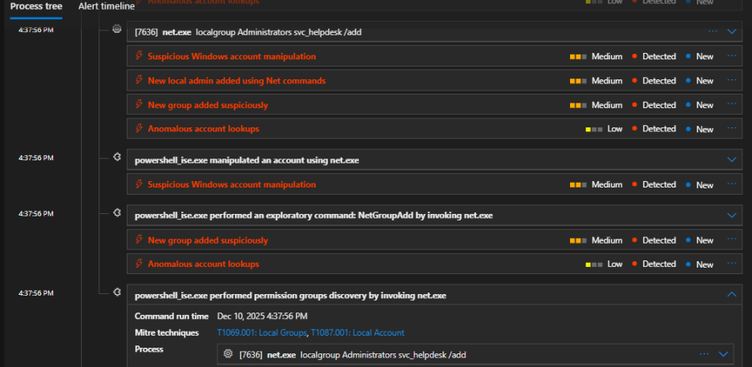
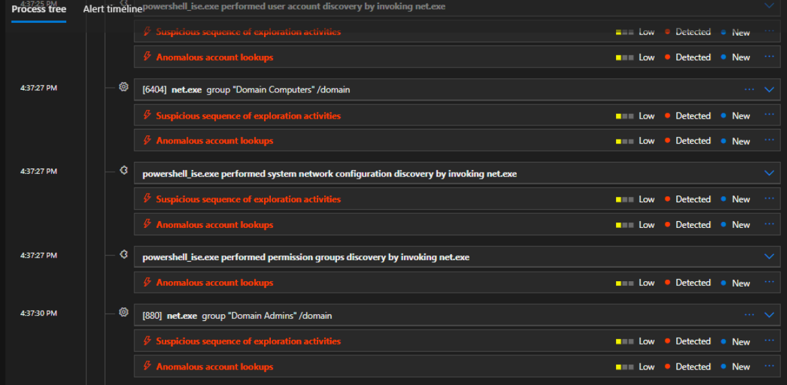
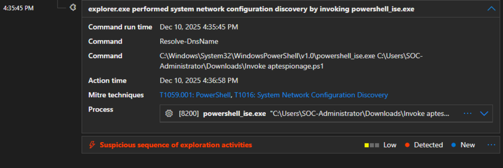

# SOC Investigation Report

## A Malicious PowerShell Cmdlet Invocation

---

## Findings

- **Time:** 2025-12-10 15:14:33 – 16:37:56 (Local Time)
- **Host:** DESKTOP-1
- **User:** SOC-Administrator
- **IOC (C2 IP):** 185.199.108.50
- **Filenames Observed:**
  - Invoke-RMMAbuse.ps1
  - Invoke aptespionage.ps1
- **Possible Malware Family:** Custom Espionage / Post-Exploitation Tooling

---

## Investigation Summary

On December 10, 2025, I conducted a deep-dive investigation into a series of high-severity alerts on **DESKTOP-1**. By reconstructing the Microsoft XDR process tree, I determined that the intrusion was a **two-stage attack** that began at **15:14:33**, well before the initial automated alerts were triggered.

The attacker initially executed **Invoke-RMMAbuse.ps1** to harvest browser-stored credentials and establish a Command and Control (C2) connection to **185.199.108.50:443**.

Following this activity, a critical **Credential Dump** was performed by exporting the **SAM** and **SYSTEM** registry hives to temporary files, granting the attacker access to local account password hashes.

At **16:35:45**, the second stage of the intrusion began with the execution of **Invoke aptespionage.ps1**. This script focused on **Domain Discovery**, specifically enumerating **Domain Admins** and **Domain Controllers**.

The attacker then transitioned into the **Persistence** phase by creating a local administrative backdoor account named **svc_helpdesk** and registering a masqueraded scheduled task named **WindowsUpdateCheck** to ensure long-term access.

In the final phase of the intrusion, the attacker attempted to **disable Microsoft Defender** and **delete system backups** to evade detection and prevent system recovery.

---

## Who, What, When, Where, Why, How

### Who
The **SOC-Administrator** account on **DESKTOP-1** was hijacked and used to perform all malicious actions.

### What
The incident involved:
- Browser credential theft
- SAM registry dumping (hash theft)
- Exhaustive domain reconnaissance
- Creation of a persistent local administrative backdoor

### When
The malicious activity occurred between **15:14:33 and 16:37:56 on 2025-12-10**. Due to the presence of persistence mechanisms, the threat remained active until remediation.

### Where
The primary activity occurred on **DESKTOP-1**, while the discovery phase targeted the **entire Windows domain infrastructure**.

### Why
The attacker’s intent was to harvest **high-privilege credentials**, map the domain environment, and prepare for **lateral movement** and potential **domain-wide compromise**.

### How
Two malicious PowerShell scripts were executed from the **Downloads** directory. The attacker leveraged native Windows binaries, including:

- `reg.exe`
- `net.exe`
- `schtasks.exe`
- `bcdedit.exe`

This behavior demonstrates extensive use of **Living-off-the-Land (LotL)** techniques.

---

## MITRE ATT&CK Mapping

| Tactic | Technique ID | Technique Name | Evidence / Observation |
|------|-------------|----------------|------------------------|
| Execution | T1059.001 | PowerShell | Execution of Invoke-RMMAbuse.ps1 and Invoke aptespionage.ps1 |
| Persistence | T1136.001 | Local Account | Creation of the `svc_helpdesk` account via `net user /add` |
| Persistence | T1053.005 | Scheduled Task | Creation of `WindowsUpdateCheck` via `schtasks.exe` |
| Privilege Escalation | T1078.003 | Local Accounts | Adding `svc_helpdesk` to the local Administrators group |
| Credential Access | T1003.002 | Security Account Manager | Exporting `HKLM\SAM` and `SYSTEM` hives using `reg.exe save` |
| Discovery | T1087.002 | Domain Account Discovery | Enumeration of Domain Admins and Domain Computers |
| Discovery | T1482 | Domain Trust Discovery | Use of `nltest.exe /domain_trusts` |
| Defense Evasion | T1562.001 | Impair Defenses | Attempted removal of the WinDefend service |
| Defense Evasion | T1070.004 | Indicator Removal | Deletion of scheduled tasks to hide activity |
| Impact | T1490 | Inhibit System Recovery | Disabling recovery and deleting system backups |
| Command and Control | T1071.001 | Web Protocols | Outbound connection to `185.199.108.50:443` |

---

## Recommendations

1. **Host Isolation**  
   Immediately isolate **DESKTOP-1** from the network to terminate C2 communication and prevent lateral movement.

2. **Credential Revocation**  
   Force password resets for the **SOC-Administrator** domain account and all local accounts on DESKTOP-1.

3. **Backdoor Cleanup**  
   Remove the **svc_helpdesk** account and delete the **WindowsUpdateCheck** scheduled task.

4. **Forensic Rebuild**  
   Perform a full system re-image. Registry manipulation, backup deletion, and security service tampering indicate deep system compromise.

5. **Domain Hunting**  
   Conduct domain-wide searches for:
   - Network traffic to **185.199.108.50**
   - Creation of the **svc_helpdesk** account on other hosts

---

> **Disclaimer:** This investigation was conducted in a controlled lab environment using simulated attack activity. All hosts, users, IP addresses, filenames, and indicators are fictitious and used solely for educational and portfolio purposes. Any resemblance to real systems or organizations is purely coincidental.
