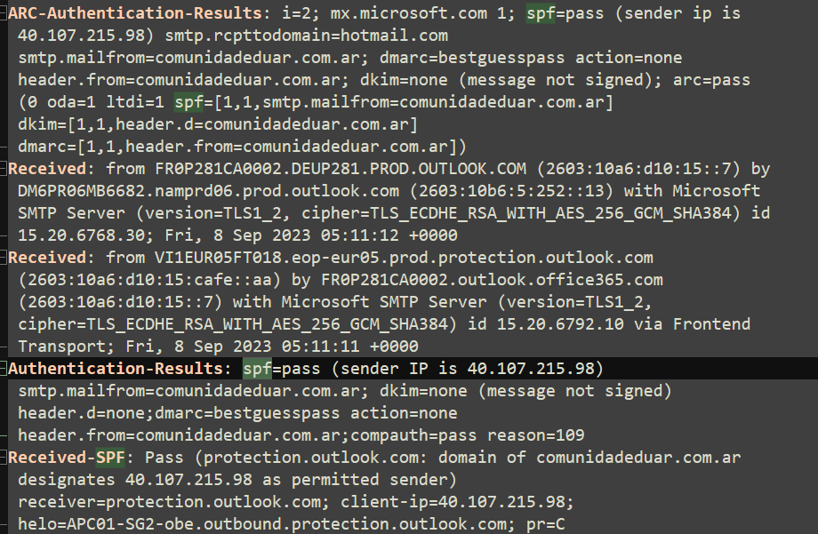
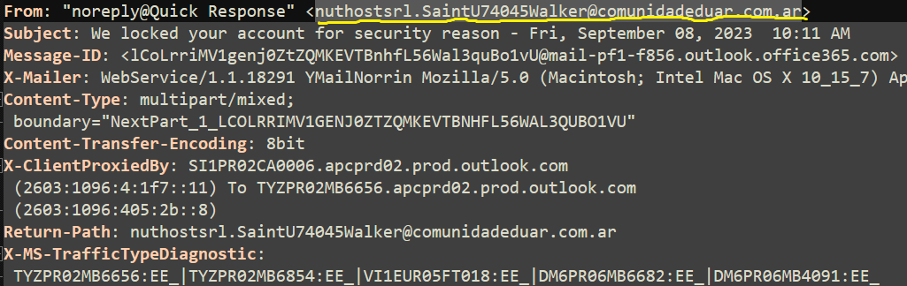
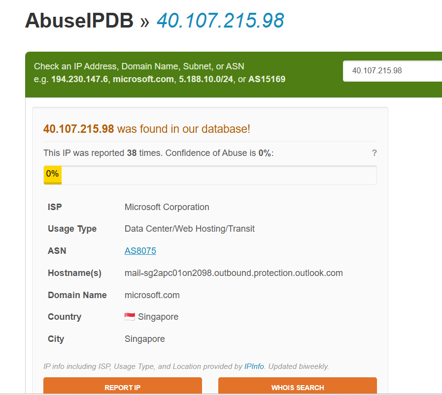
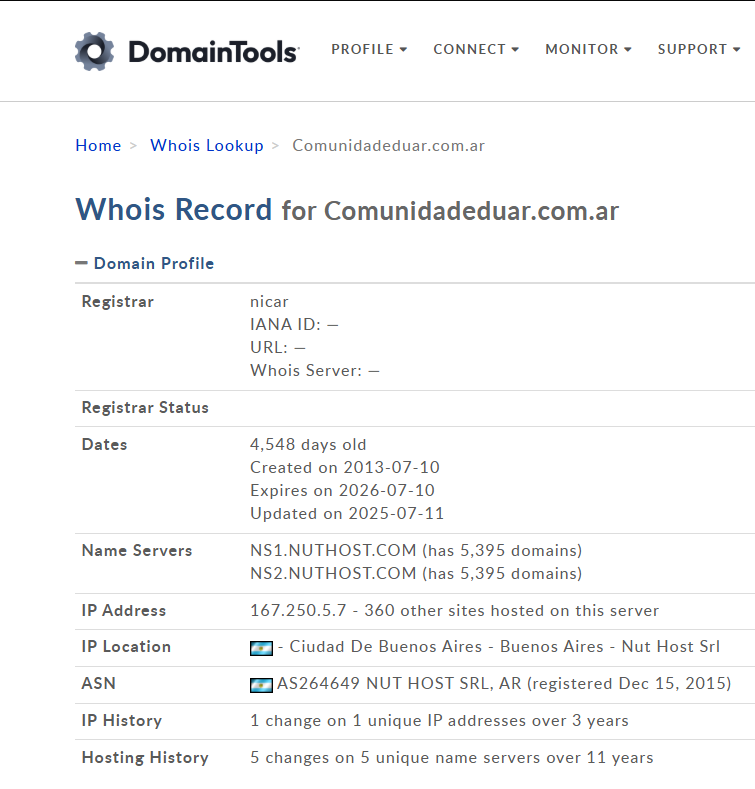
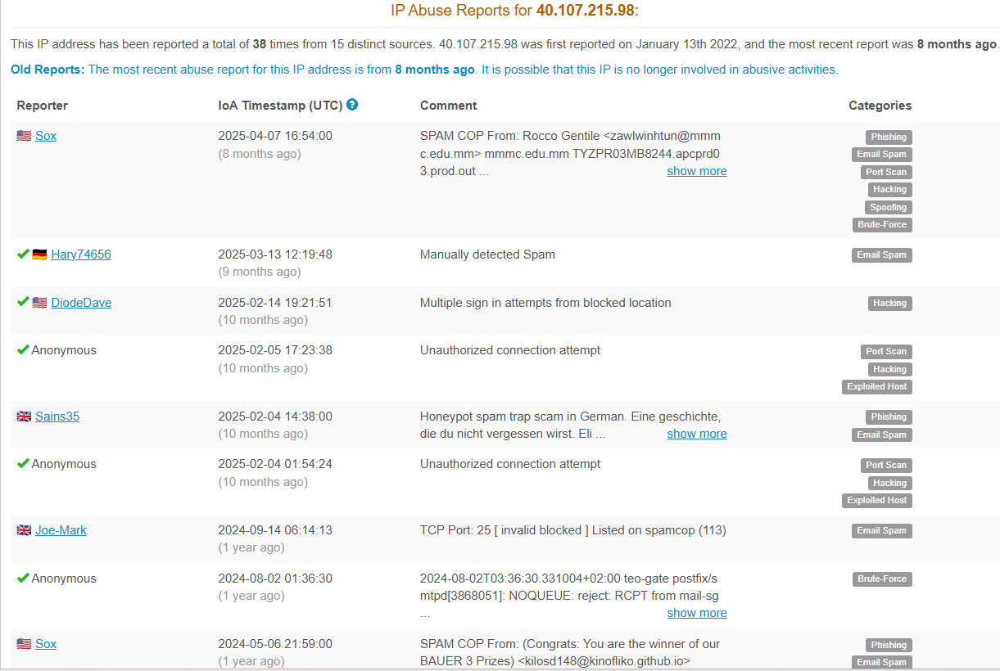

## Introduction

### Description
This project documents a second hands-on phishing email investigation conducted as part of a structured email analysis lab. The objective was to analyze a suspicious email using header inspection and OSINT techniques, identify indicators of malicious activity, and assess the overall risk in a manner consistent with Tier 1 SOC triage.

### Objective
The goals of this investigation were to:

- Analyze a suspicious email in a different attack scenario
- Identify malicious indicators within headers and embedded links
- Determine whether the email required escalation or could be safely closed

  ## Email Artifact Reviewed (What Was Analyzed)

This analysis was performed on the raw `.eml` content (opened in a text editor). The investigation focused on the following sections of the email:

### 1) Message Routing & Origin (Received chain)
- Reviewed the `Received:` headers to identify the sending infrastructure and trace the message path through Microsoft/Outlook protection layers.
- Confirmed the sending IP address observed in header authentication results:
  - `40.107.215.98`

### 2) Email Authentication Results
- Extracted results from:
  - `Authentication-Results:`
  - `ARC-Authentication-Results:`
  - `Received-SPF:`
- Observed SPF results tied to the sender domain:
  - `smtp.mailfrom=comunidadeduar.com[.]ar`

### 3) Sender/Recipient Metadata
Reviewed core identity and tracking fields:
- `From:` `nuthostsrl.SaintU74045Walker@comunidadeduar[.]com.ar`
- `To:` `Phishingisfun@hotmail[.]com`
- `Subject:` `We locked your account for security reason - Fri, September 08, 2023 10:11 AM`
- `Date:` `Fri, 8 Sep 2023 10:11:07 +0500`
- `Return-Path:` `nuthostsrl.SaintU74045Walker@comunidadeduar[.]com.ar`
- `Message-ID:` `<lCoLrriMV1genj0ZtZQMKEVTBnhfL56Wal3quBo1vU@mail-pf1-f856.outlook.office365.com>`
  

### 4) MIME Structure (Content-Type and Attachments)
- Identified the email as a multipart message:
  - `Content-Type: multipart/mixed; boundary="NextPart_1_..."`

- Confirmed the message contained:
  - An HTML body part (`Content-Type: text/html`)
  - An attachment delivered as base64 with a PDF filename:
    - `Detailsdisable-262340.pdf`

### 5) Embedded Link in HTML Body (User Interaction Risk)
- Extracted the link destination present in the email body:
  - `script.google[.]com` (Google Apps Script URL)
 
  ### Impersonation Indicators (Evidence)
- The email content impersonates Amazon, but the sender domain is `comunidadeduar.com.ar`.
- The call-to-action link directs to `script.google[.]com` rather than an Amazon-owned domain.

---

## Lab Questions — Second Email Analysis

---

### 1) What is the sender’s IP address?

**Answer:**  
`40.107.215.98`

---

### 2) Who is the ISP for this IP?

**Answer:**  
`Microsoft`
- 
---

### 3) What is the domain name of the true sender?

**Answer:**  
`comunidadeduar[.]com.ar`

---

### 4) What is the reported date of this email?

**Answer:**  
`Fri, 8 Sep 2023 10:11:07 +0500`

---

### 5) When was the domain of the sender created?

**Answer:**  
`2013-07-10`

- 
  
---

### 6) If the email were to fail to deliver, what email would receive the failure notice?

**Answer:**  
`nuthostsrl.SaintU74045Walker@comunidadeduar[.]com.ar`

---

### 7) What is the subject line of this email?

**Answer:**  
`We locked your account for security reason - Fri, September 08, 2023 10:11 AM`

---

### 8) How many “Content-Type” are there in this email and which format(s) are rendered?

**Answer:**  
There are **two Content-Type values** present:
- `text/html`
- `text/html` (base64)

The mail server renders the message as **HTML**, with an additional **base64-encoded HTML attachment**.

---

### 9) What is the “Message-ID” for this email?

**Answer:**

<lCoLrriMV1genj0ZtZQMKEVTBnhfL56Wal3quBo1vU@mail-pf1-f856.outlook.office365[.]com>

---

### 10) What is the suspicious domain within the body of the email?

**Answer:**
script.google[.]com

---

### Mismatched Display vs Actual Destination

In the HTML body, the email contains a hyperlink that visually appears to reference a legitimate and well-known domain:

At first glance, a user may believe they are interacting with a trusted domain such as facebook.com, especially since it is placed near branding elements and styled to look legitimate. However, the actual destination (href) points to a completely different domain:hxxps://script[.]google[.]com/macros/s/<script-id>/exec

This endpoint is commonly used to execute Google Apps Scripts, which attackers frequently abuse for phishing campaigns because:

- The domain (script[.]google[.]com) is trusted and often allowed through security controls

- Scripts can act as redirectors or credential-harvesting pages

- Content can be quickly modified or taken down, limiting detection windows

The presence of /exec strongly suggests the link is designed to run a script rather than display a static page. In phishing scenarios, this often leads to:

- Fake login pages

- Redirects to secondary malicious domains

- Collection of submitted credentials or personal data

## Recap of Findings

Based on my analysis of the email headers, body content, and supporting OSINT:

- The sender domain has previously been reported for phishing activity in the wild.
- The sending IP address belongs to Microsoft infrastructure and has been reported for email spam activity according to AbuseIPDB.
- 
- SPF authentication passed, indicating the sending IP is authorized to send mail on behalf of the sender domain.
- No **Reply-To** header was present in the email.
- The display name in the **From** field does not align with the actual sender email address, which is a common indicator of phishing.
- The email body exhibits phishing characteristics, including a scarcity/urgency tactic and a hyperlink leading to a domain that may act as a redirect or credential-harvesting page, based on URLScan analysis.
- ## Deceptive Link Analysis (HTML Body)

One of the most deceptive elements of this phishing email is how hyperlinks are intentionally manipulated to mislead the user.

---

## Conclusion

This investigation involved analyzing a suspicious email using static header analysis and targeted OSINT without opening the message in an email client. By reviewing key email headers, authentication results, and the embedded HTML content, I was able to determine that the email was a phishing attempt.

The sender made use of legitimate infrastructure and a trusted domain (`script.google[.]com`) to bypass basic security controls, while impersonating a well-known brand to create urgency and pressure the recipient into taking action. Several indicators, including a sender and domain mismatch, deceptive link behavior, and potential credential-harvesting activity, support this conclusion.

From a Tier 1 SOC perspective, this email would require containment, verification of user interaction, and escalation if any user engagement is identified. This investigation shows how header analysis combined with OSINT can be effective in identifying phishing attempts, even when authentication checks such as SPF pass.

Overall, this lab reinforced the importance of looking beyond basic email authentication results, understanding common attacker techniques, and clearly documenting findings to support operational response.

